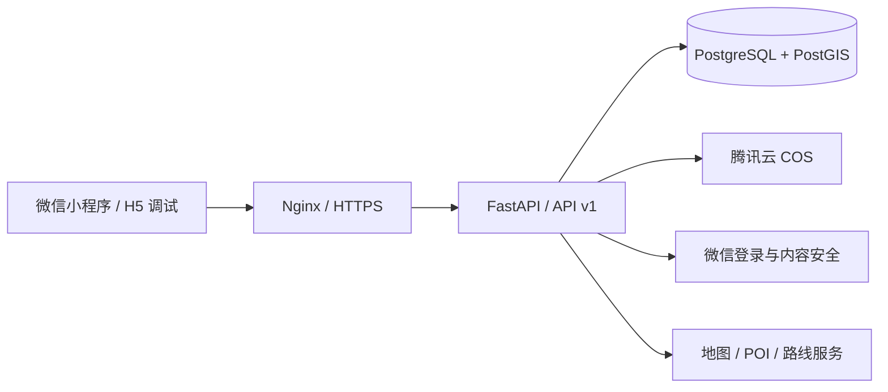

<p align="center">
  
</p>

<p align="center">
  
</p>

<p align="center">
  面向校园猫协日常协作的地图与记录型微信小程序
</p>

<p align="center">
  <a href="https://github.com/N1etZsch3/tuanrong-meow-notes/releases/latest"></a>
  
  
  
  
</p>

<p align="center">
  <a href="#项目简介">项目简介</a> ·
  <a href="#核心能力">核心能力</a> ·
  <a href="#技术架构">技术架构</a> ·
  <a href="#本地开发">本地开发</a> ·
  <a href="#项目文档">项目文档</a>
</p>

## 项目简介

团绒喵记本将校园地图、猫咪档案、喂食任务、物资点、校园地标、药品库存和成员协作收拢到一个微信小程序中。成员可以围绕真实地点查看信息、记录行动和完成任务，管理员则可以维护人员、点位与日常业务数据。

项目采用前后端分离架构，以微信小程序为首要客户端，同时保留 H5 调试能力；后端 API 统一位于 `/api/v1`，数据持久化使用 PostgreSQL 与 PostGIS。

> [!IMPORTANT]
> 当前 GitHub 最新发布为 [v1.1.3](https://github.com/N1etZsch3/tuanrong-meow-notes/releases/tag/v1.1.3)。微信平台的实际上传、审核与正式版本状态请以 [开发进度](docs/开发进度.md) 为准。

## 核心能力

| 模块 | 能力 |
| --- | --- |
| 喵图 | 校园点位、分类筛选、搜索、当前位置、POI 关联、步行路线与点位详情 |
| 猫咪库 | 猫咪档案列表、统计、筛选与图片展示 |
| 喵记 | 喂食任务、周期任务、任务记录，以及物资、地标、药品等日常入口 |
| 物资与地标 | 物资点、校园地标的列表、详情、图片和地图选点 |
| 药品管理 | 药品分类、药品主档、成员持有库存、库存流水与用药申请 |
| 成员与权限 | 邀请制账号、首次改密、微信 OpenID 绑定、角色权限与成员管理 |
| 图片服务 | 对象存储、业务图片回显、头像内容安全审核与原生大图预览 |
| 管理端 | 人员、任务、物资点、地标点、药品及账号状态管理 |

## 技术架构

| 层级 | 技术 |
| --- | --- |
| 小程序前端 | uni-app、Vue 3、TypeScript、Pinia、Vitest |
| 后端 API | FastAPI、Pydantic v2、SQLAlchemy 2.0、Alembic、PyJWT |
| 数据与空间能力 | PostgreSQL、PostGIS、pgcrypto |
| 文件与平台集成 | 腾讯云 COS、微信登录、微信图片内容安全、地图与路线服务 |
| 部署与质量 | Nginx、systemd、HTTPS、Pytest、Ruff、vue-tsc |



## 仓库结构

```text
.
├── backend/                 FastAPI 服务、领域模块、测试与 Alembic 迁移
├── frontend/                uni-app 微信小程序、H5 调试入口、测试与素材
├── deploy/                  Nginx、systemd 等部署配置
├── scripts/                 部署、环境保护与契约校验脚本
├── docs/                    模块、接口、库表、计划、发布与进度文档
├── AGENTS.md                项目开发手册与安全规则
└── README.md                仓库入口文档
```

## 本地开发

### 环境要求

- Python 3.11
- Node.js 与 npm
- PostgreSQL，并启用 PostGIS
- 微信开发者工具（调试微信小程序时需要）
- 项目所需的地图、对象存储和微信平台本地配置

> [!CAUTION]
> `.env`、真实 AppID、密钥、Token、证书和私有环境配置必须保留在 Git 忽略文件中。不要把真实值写入 README、提交记录或测试输出。

### 启动后端

在 PowerShell 中执行：

```powershell
cd backend
py -3.11 -m pip install -e ".[dev]"
Copy-Item .env.example .env

# 配置本地 PostgreSQL/PostGIS 与所需外部服务后：
py -3.11 -m alembic upgrade head
py -3.11 -m uvicorn app.main:app --reload
```

服务启动后可检查：

```text
GET http://127.0.0.1:8000/api/v1/health
```

后端的完整环境和接口说明见 [backend/README.md](backend/README.md)。

### 启动前端

```powershell
cd frontend
npm ci

# 微信小程序开发构建
npm run dev:mp-weixin

# 或使用 H5 进行浏览器调试
npm run dev:h5
```

生产构建必须提供真实的 HTTPS API 地址，并保持本地生产配置不进入 Git：

```powershell
npm run build:mp-weixin
```

前端配置约束和脚本说明见 [frontend/README.md](frontend/README.md)。

## 验证

提交前先运行受影响范围的测试，再执行对应的完整检查。

### 后端

```powershell
cd backend
py -3.11 -m pytest -q
py -3.11 -m ruff check .
py -3.11 -m alembic upgrade head
```

### 前端

```powershell
cd frontend
npm run test -- --run
npm run type-check
npm run build:mp-weixin
```

涉及导航、定位、原生地图、图片上传、微信登录或平台权限的修改，还需要在微信开发者工具和真机中手动验收。

## 项目文档

| 文档 | 用途 |
| --- | --- |
| [AGENTS.md](AGENTS.md) | 开发流程、Git 工作树、安全、验证和交接规范 |
| [开发进度](docs/开发进度.md) | 当前版本、线上状态、最近验证结果与待办 |
| [Git 版本管理说明](docs/Git版本管理说明.md) | 分支、标签、发布与热修流程 |
| [接口设计规范](docs/接口文档/接口设计规范文档.md) | `/api/v1` 契约、响应与错误格式 |
| [模块功能文档](docs/模块功能) | 各业务模块的功能边界与流程 |
| [接口文档](docs/接口文档) | 各模块 API 契约 |
| [库表文档](docs/库表文档) | 数据模型、字段与关系说明 |
| [发布说明](docs/releases) | 各 GitHub Release 的更新内容 |

## 开发约定

开始修改前请先阅读 [AGENTS.md](AGENTS.md)，并遵循以下原则：

- 以当前代码和最新进度记录为事实来源。
- 一个分支只处理一个聚焦任务，普通开发从 `dev` 创建工作分支。
- 显式暂存需要提交的文件，不使用 `git add .`。
- API 或数据库契约变化必须同步测试、迁移和对应文档。
- 开发或发布工作完成后更新 `docs/开发进度.md`。
- 推送前检查密钥、AppID、Token、私有域名和环境值。

---

<p align="center">让每一次照顾都有迹可循，让校园里的每一只猫都被温柔看见。</p>
